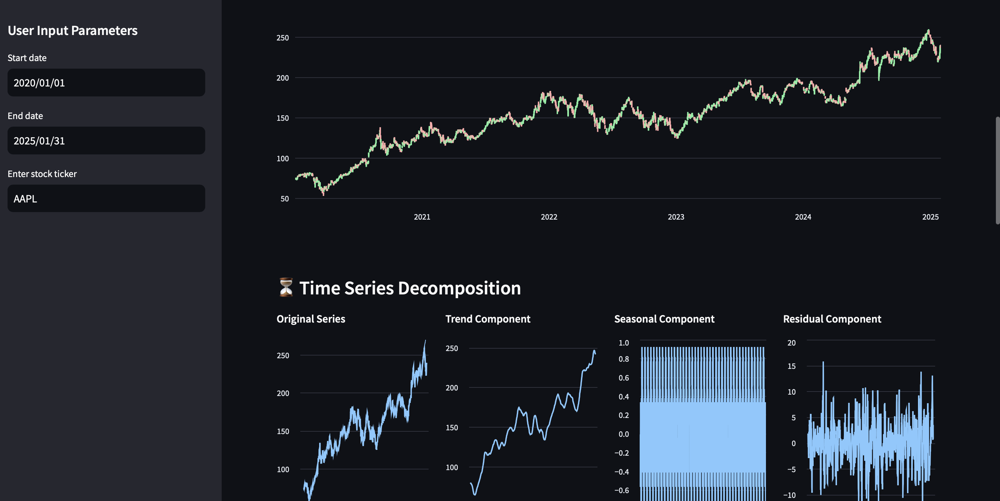

# Stock Analysis & Forecasting 📈

[](https://streamlit.app/)


An interactive web dashboard for stock price analysis and forecasting using Streamlit and machine learning.

 

### Features ✨

- **Historical Data Display**: View 10-day historical prices for any stock
- **Interactive Visualizations**:
  - Price movement line chart
  - Candlestick chart
  - Time series decomposition (trend, seasonality, residuals)
- **Price Forecasting**: Facebook Prophet-powered predictions (30-365 days)
- **Company Information**: Automatic company name detection with smart fallbacks
- **Responsive Design**: Works on both desktop and mobile devices

### Installation 🛠️

1. Clone the repository:
   ```bash
   git clone https://github.com/optimizedLP/stock-market-dashboard.git
   cd stock-market-dashboard

2. Install all dependencies:
    ```bash
    pip install -r requirements.txt

3. Deploy the dashboard:
    ```bash
    streamlit run dash.py


### Usage 🖥️
* Enter a stock ticker symbol (e.g., AAPL, GOOG, TSLA)
* Select date range using the sidebar controls
* Explore different tabs:
  - Historical Data: Raw price data table
  - Price Charts: Interactive line and candlestick charts
  - Decomposition: Time series component analysis
  - Forecasting: Future price predictions with adjustable horizon


### Technologies Used 💻
  * yFinance - Yahoo Finance data API
  * Prophet - Time series forecasting
  * statsmodels - Time series decomposition


### Future Improvements 🚀
  * Add multiple ticker comparison
  * Include technical indicators (RSI, MACD, Bollinger Bands)
  * Implement alternative forecasting models (LSTM, ARIMA)
  * Add news sentiment analysis integration
  * Support cryptocurrency analysis


### Notes ⚠️
  * Some less common ticker symbols may require manual company name mapping
  * Forecast accuracy depends on market conditions and historical data quality
  * Data availability subject to Yahoo Finance's API limitations


### 🤝 Let's Connect

- [LinkedIn](https://www.linkedin.com/in/dpjani)
- [Personal Website](https://dpjani.github.io)
